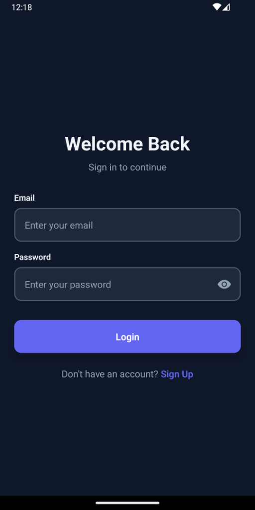
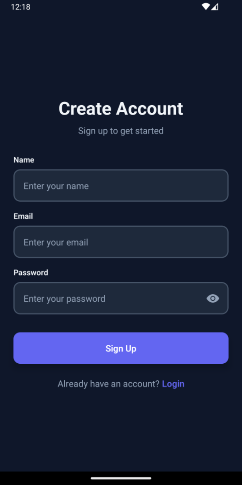
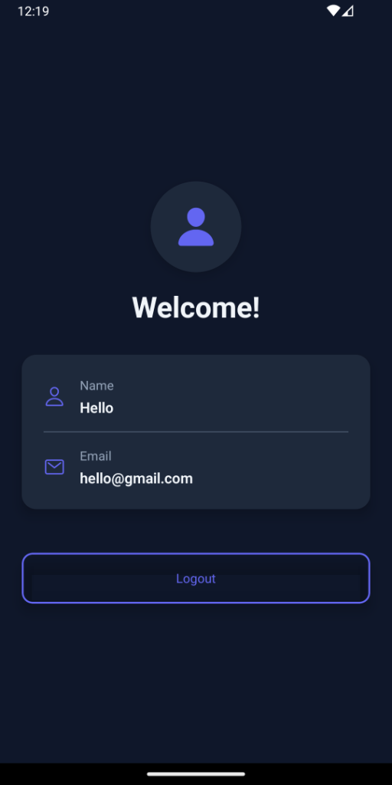

# User Authentication App - Bare React Native

[](https://github.com/nainglynndw/UserAuthApp/actions/workflows/android_build.yml)

A **production-grade** React Native authentication app built with **bare React Native CLI**

## 📱 Screenshots

<p align="center">
  
  
  
</p>

## 🏗️ Architecture

### ✅ Production Standards
- **Bare React Native CLI** - No Expo
- **No Barrel Files** - Direct imports for better tree-shaking
- **Separated Styles** - Each component has `.styles.ts` file
- **Utils Layer** - Business logic separated from UI
- **Custom Hooks** - Logic separated from presentation
- **One Component Per File** - Single responsibility principle
- **TypeScript** - Full type safety
- **Smooth Animations** - Native Animated API
- **CI/CD** - GitHub Actions for automated builds

### 📁 Structure
```
src/
├── utils/              # Pure business logic
│   ├── validation.ts
│   ├── storage.ts
│   └── auth.ts
├── components/         # Reusable UI (no barrel files)
│   ├── Button/
│   │   ├── Button.tsx
│   │   └── Button.styles.ts
│   └── Input/
│       ├── Input.tsx
│       └── Input.styles.ts
├── screens/            # Screen components with hooks
│   ├── LoginScreen/
│   │   ├── LoginScreen.tsx
│   │   ├── LoginScreen.styles.ts
│   │   └── useLoginScreen.ts
│   ├── SignupScreen/
│   │   ├── SignupScreen.tsx
│   │   ├── SignupScreen.styles.ts
│   │   └── useSignupScreen.ts
│   └── HomeScreen/
│       ├── HomeScreen.tsx
│       └── HomeScreen.styles.ts
├── navigation/
│   ├── types.ts
│   └── navigators/     # One navigator per file
│       ├── AuthNavigator.tsx
│       ├── AppNavigator.tsx
│       └── RootNavigator.tsx
├── context/
│   └── AuthContext.tsx
├── constants/
│   └── theme.ts
└── types/
    └── index.ts
```

## 🚀 Setup

### Prerequisites
- Node.js 18+
- Xcode (for iOS)
- Android Studio (for Android)
- CocoaPods (for iOS dependencies)

### Installation

```bash
# Install dependencies
npm install

# iOS setup
cd ios
bundle install
bundle exec pod install
cd ..

# Run on iOS
npm run ios

# Run on Android
npm run android
```

## ✨ Features

- ✅ Login with email/password
- ✅ Signup with validation
- ✅ AsyncStorage persistence
- ✅ Password visibility toggle
- ✅ Form validation
- ✅ Loading states
- ✅ Smooth fade-in animations
- ✅ Button press animations
- ✅ Modern dark theme UI

## 🧪 Test Credentials

- **Email:** john@example.com
- **Password:** password123

## 🤖 CI/CD

This project uses GitHub Actions for continuous integration:

- **Automated Builds:** Every push triggers an Android build
- **TypeScript Validation:** Code is type-checked before building
- **APK Artifacts:** Download the latest APK from [GitHub Actions](https://github.com/nainglynndw/UserAuthApp/actions)

### Download APK from CI

1. Go to [Actions](https://github.com/nainglynndw/UserAuthApp/actions)
2. Click on the latest successful workflow run
3. Scroll down to **Artifacts**
4. Download `app-debug.apk`
5. Install on your Android device

## 📦 Dependencies

**Core:**
- `react-native` 0.83.1
- `typescript`

**Navigation:**
- `@react-navigation/native`
- `@react-navigation/native-stack`
- `react-native-screens`
- `react-native-safe-area-context`

**Storage:**
- `@react-native-async-storage/async-storage`

**Icons:**
- `react-native-vector-icons`

## 🎨 Design

- Modern dark theme with vibrant purple accents
- Smooth animations using React Native's Animated API
- Glassmorphism effects
- Responsive layouts
- Clean, minimal UI

## 🔐 Security

This is a demo with mock authentication. For production:
- Replace `utils/auth.ts` with real API
- Use JWT/OAuth
- Never store passwords client-side
- Implement proper session management

## 📊 Development

```bash
# Type check
npx tsc --noEmit

# Clean Android build
cd android && ./gradlew clean && cd ..

# Clean iOS build
cd ios && pod install && cd ..
```

---

**Built with:** Bare React Native CLI 0.83.1, TypeScript, React Navigation, AsyncStorage
